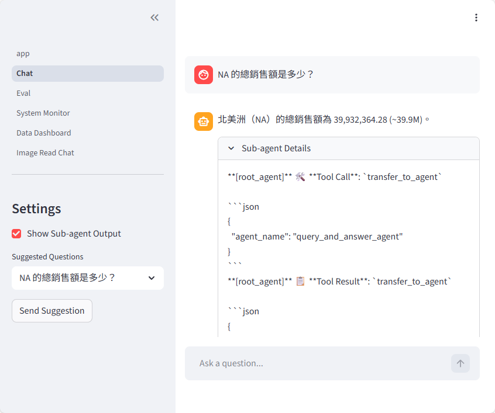
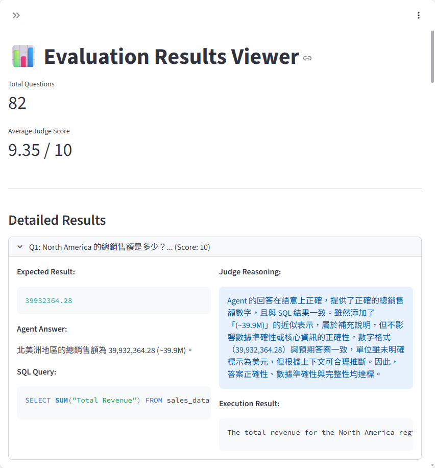
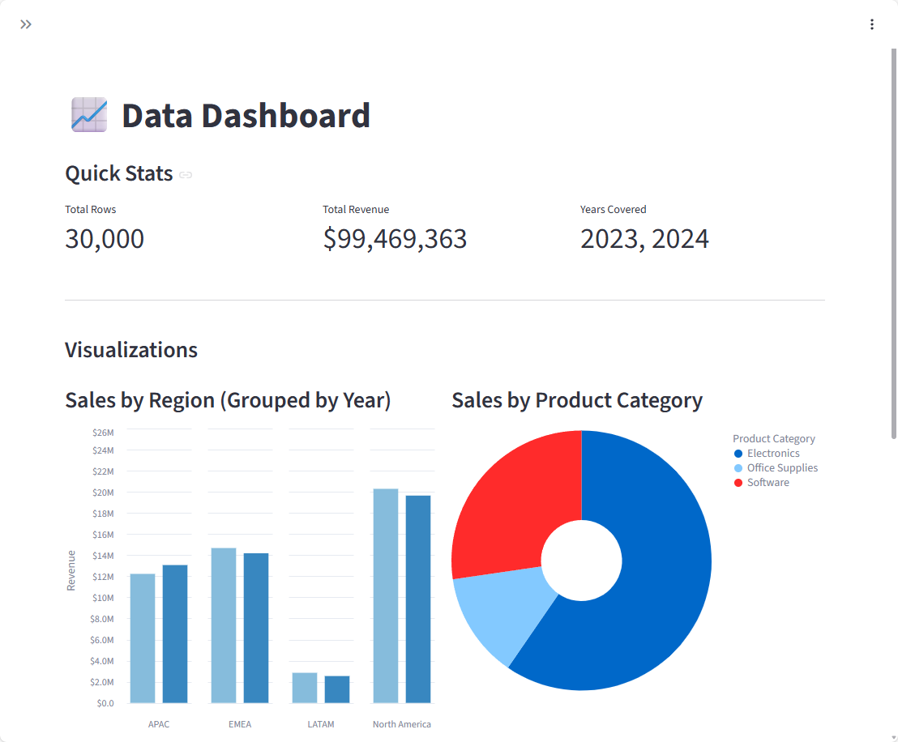
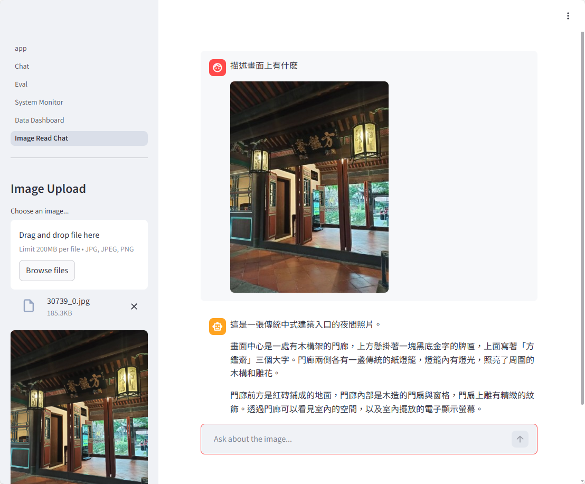

# Text-to-SQL 多代理系統

一個基於 Google ADK 的自然語言轉 SQL 查詢系統，採用多代理協作架構，具備自我修正能力與 LLM-as-Judge 評估機制。

## 🔗 Demo

**線上展示**：[https://agent-show.ivan-labs.com](https://agent-show.ivan-labs.com)

> ⚠️ 部署於本地主機，訪問前請先聯繫作者加入 Cloudflare Zero Trust 白名單


### 畫面預覽

| 代理執行過程 | 評估結果 |
|:--------:|:--------:|
|  |  |

| 資料儀表板 | 多模態本地模型 |
|:--------:|:--------:|
|  |  |


## 專案亮點

- **多代理協作架構**：採用 SequentialAgent + LoopAgent 設計，實現任務分解與迭代優化
- **自我修正機制**：透過 Critic Agent 審查查詢結果，自動觸發重試修正（最多 3 次）
- **完整評估框架**：包含 100+ 測試案例，搭配 LLM-as-Judge 自動評分
- **本地模型部署**：使用 llama.cpp 運行 Qwen3-4B，支援離線運行

## 系統架構

```
┌─────────────────────────────────────────────────────────────────┐
│                         Root Agent                              │
│                    (任務分派與回應整合)                            │
└─────────────────────────┬───────────────────────────────────────┘
                          │
                          ▼
┌─────────────────────────────────────────────────────────────────┐
│                  Query & Answer Agent                           │
│                    (SequentialAgent)                            │
│  ┌────────────────────────────────────────────────────────────┐ │
│  │              Get Data Agent (LoopAgent)                    │ │
│  │  ┌──────────────────────────────────────────────────────┐  │ │
│  │  │  SQL Generation Sequential                           │  │ │
│  │  │  ├─ Region/Country Check Agent (別名映射)              │ │ │
│  │  │  └─ SQL Gen Agent (SQL 生成)                          │  │ │
│  │  └──────────────────────────────────────────────────────┘  │ │
│  │                          ▼                                 │ │
│  │  ┌──────────────────────────────────────────────────────┐  │ │
│  │  │  SQL Critic Sequential                               │  │ │
│  │  │  ├─ Check SQL Agent (語法檢查)                        │  │ │
│  │  │  ├─ Execute SQL Agent (執行查詢)                      │  │ │
│  │  │  └─ Critic Agent (結果審查 → 決定是否重試)              │  │ │
│  │  └──────────────────────────────────────────────────────┘  │ │
│  │              ↻ Loop until correct or max retries           │ │
│  └────────────────────────────────────────────────────────────┘ │
│                          ▼                                      │
│  ┌────────────────────────────────────────────────────────────┐ │
│  │              Answer Agent (商業語言回覆)                     │ │
│  └────────────────────────────────────────────────────────────┘ │
└─────────────────────────────────────────────────────────────────┘
```

## 專案結構

```
.
├── src/text2sql/agents/          # 核心代理系統
│   ├── planned_agent/            # 主要 Text-to-SQL 代理
│   └── pic_read_agent/           # 視覺語言模型代理
│
├── eval/                         # 評估系統
│   ├── eval.py                   # 評估執行腳本
│   └── judge/                    # LLM-as-Judge 評分代理
│
├── scripts/                      # 資料與評估集生成腳本
│
├── web_ui/                       # Streamlit Web 介面
│   ├── 1_Chat.py                 # 對話介面（可觀察代理執行過程）
│   ├── 2_Eval.py                 # 評估結果檢視
│   ├── 3_System_Monitor.py       # GPU 監控
│   ├── 4_Data_Dashboard.py       # 資料視覺化
│   └── 5_Image_Read_Chat.py      # 圖片理解對話
│
└── data/                         # 合成銷售資料與評估集
```

## 開發流程

採用**評估驅動開發 (Evaluation-Driven Development)**：

```
1. 建立評估資料集    →    2. 開發代理系統    →    3. LLM Judge 評分    →    4. 迭代優化
   (scripts/)              (src/)                 (eval/)                  (web_ui 驗證)
```

## 技術細節

### 代理設計模式

```python
# LoopAgent: 自我修正迴圈
get_data_agent = LoopAgent(
    sub_agents=[sql_gen_sequential, sql_critic_sequential],
    max_iterations=3  # 最多重試 3 次
)

# Critic Agent: 透過 exit_loop 工具控制迴圈
def exit_loop(tool_context: ToolContext):
    tool_context.actions.escalate = True  # 跳出迴圈
```

### 別名映射

支援多語言輸入自動轉換：

| 使用者輸入 | 資料庫值 |
|-----------|---------|
| 亞太區 / APAC / Asia Pacific | `Region = 'APAC'` |
| 中國 / China / 大陸 | `Country = 'China'` |

### LLM-as-Judge

- 使用 Structured Output 確保評分格式一致
- 評估維度：答案正確性、數據準確性、回答完整性
- 輸出 0-10 信心分數，≥7 視為正確

## 數據範例

全球銷售數據前 5 行：

| Order ID | Order Date | Region | Country | Customer Name | Product Category | Product Name | ASP | Quantity | Total Revenue |
|----------|-----------|--------|---------|----------------|------------------|--------------|-----|----------|---------------|
| ORD-202309986 | 2023-01-01 | North America | United States | Elite Elite Systems | Electronics | Docking Station | 184.04 | 6 | 1104.24 |
| ORD-202325336 | 2023-01-01 | LATAM | Mexico | Apex Elite Systems | Electronics | 4K Monitor 27" | 345.53 | 11 | 3800.83 |
| ORD-202315895 | 2023-01-01 | North America | United States | Apex Apex Ltd. | Electronics | Pro Smartphone 15 | 1002.65 | 3 | 3007.95 |
| ORD-202328380 | 2023-01-01 | EMEA | United Kingdom | Next Beta Ltd. | Software | Team Collaboration Tool | 208.97 | 5 | 1044.85 |
| ORD-202318954 | 2023-01-01 | APAC | Singapore | Next Delta Ltd. | Office Supplies | Ergonomic Chair | 382.53 | 2 | 765.06 |

## 技術棧

| 類別 | 技術 |
|------|------|
| Agent Framework | Google ADK |
| LLM | Qwen3-4B-Instruct (via llama.cpp) |
| Database | SQLite |
| Web UI | Streamlit |

## 聯絡作者

- LinkedIn: [https://www.linkedin.com/in/yi-fan-zhang-1ba122171/]

## License

MIT
